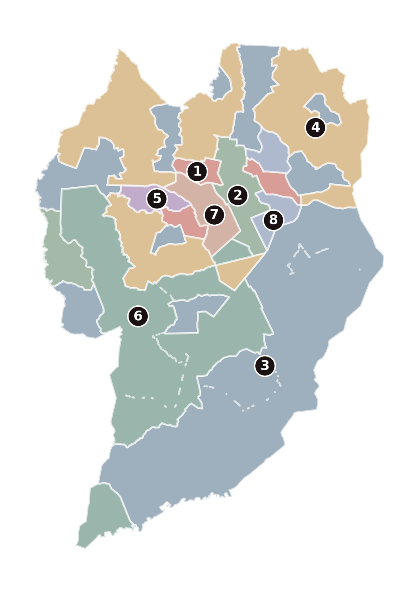
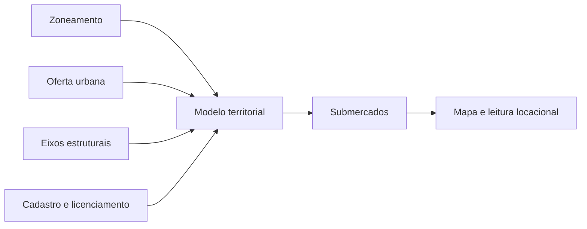

# Atlas urbano de Curitiba · submercados e modelagem territorial

Caso de modelagem territorial em escala de cidade para definir submercados urbanos a partir de zoneamento, oferta, centralidades e eixos estruturais.

## O que este caso mostra

- definição de submercados de forma auditável;
- leitura territorial de centralidades e estrutura urbana;
- cruzamento entre zoneamento, oferta e transporte;
- apoio a decisão locacional e desenvolvimento.

## Como os submercados são construídos

## Bases utilizadas

- zoneamento;
- cadastro e licenciamento;
- oferta urbana;
- eixos estruturais e transporte.

## Entregas

- definição de submercados;
- base analítica em PostGIS;
- camadas derivadas para mapas;
- leitura territorial comparável.

## Ferramentas

PostGIS · SQL espacial · Python · GeoJSON
