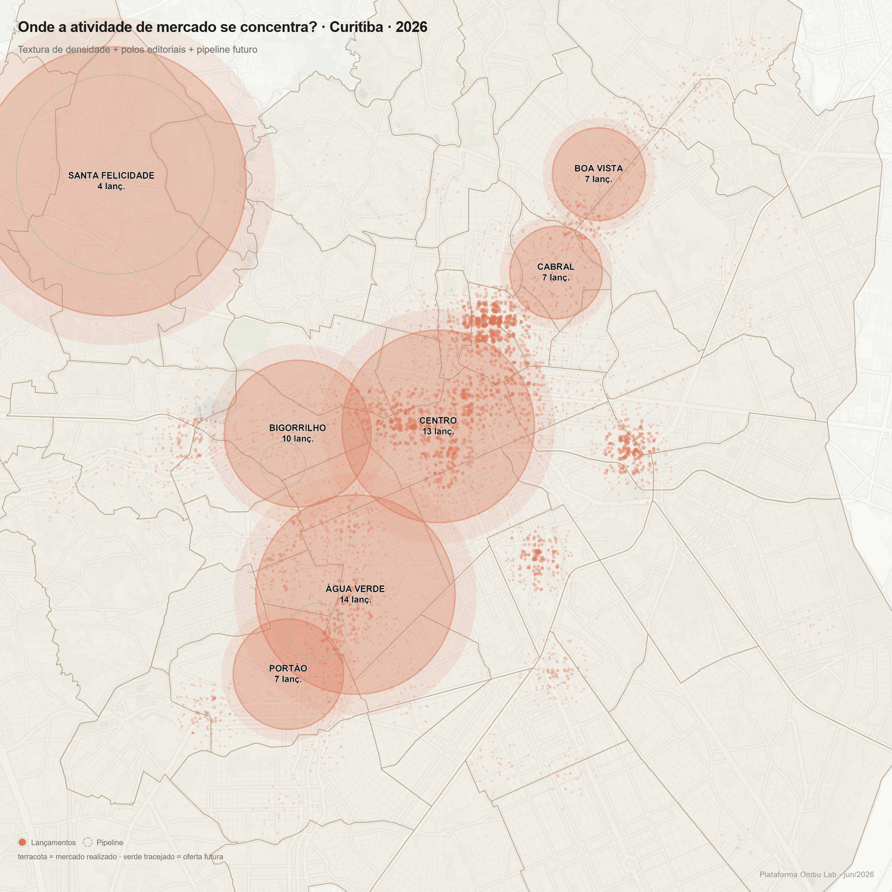
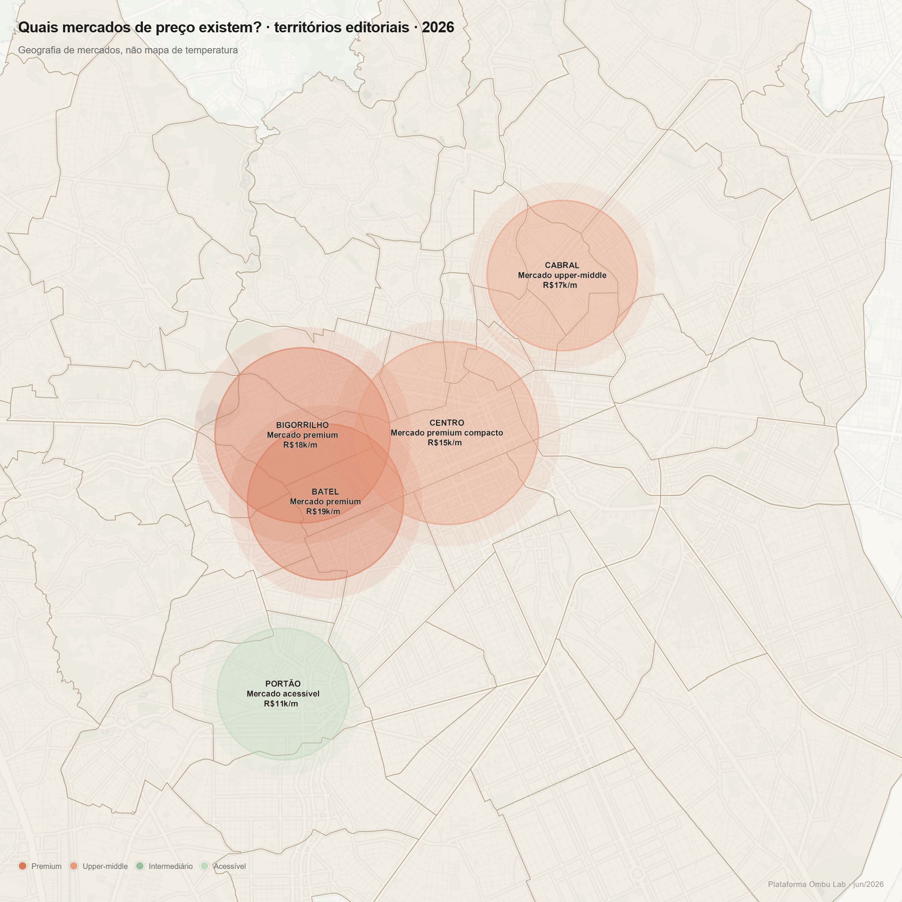
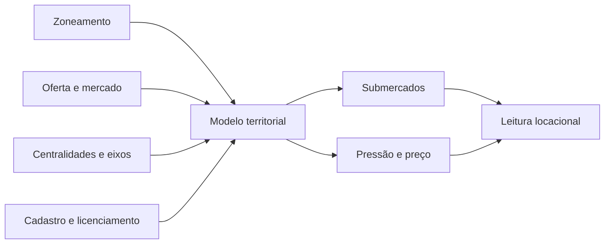

# Atlas urbano de Curitiba · submercados, pressão e leitura de mercado

Caso de modelagem territorial em escala de cidade para definir submercados urbanos, ler pressão de mercado e comparar oferta, centralidades e estrutura urbana em uma mesma base analítica.

## O que este caso mostra

- definição de submercados de forma auditável;
- leitura de pressão territorial e concentração de mercado;
- comparação entre estrutura urbana, oferta e preço;
- apoio a decisão locacional e desenvolvimento.

## 1. Submercados territoriais

O atlas organiza a cidade em campos comparáveis, evitando leituras arbitrárias. Os submercados nascem de camadas urbanas, regras territoriais e comportamento de oferta.

## 2. Pressão territorial

O atlas não mostra só “onde existe mercado”, mas onde a pressão territorial se concentra. Esse tipo de leitura permite identificar zonas mais tensionadas, deslocamentos de interesse e padrões espaciais de absorção.

## 3. Preço e mercados

A leitura de preço é feita territorialmente, não apenas como tabela. Isso ajuda a comparar bairros, submercados e relações entre posicionamento, valor e contexto urbano.

## Como o atlas é construído

## Bases utilizadas

- zoneamento;
- cadastro e licenciamento;
- oferta urbana e mercado;
- centralidades, eixos e estrutura territorial.

## Entregas

- definição de submercados;
- leitura de pressão territorial;
- comparação espacial de preço e mercado;
- base analítica em PostGIS;
- camadas derivadas para mapas e leitura editorial.

## Ferramentas

PostGIS · SQL espacial · Python · GeoJSON
