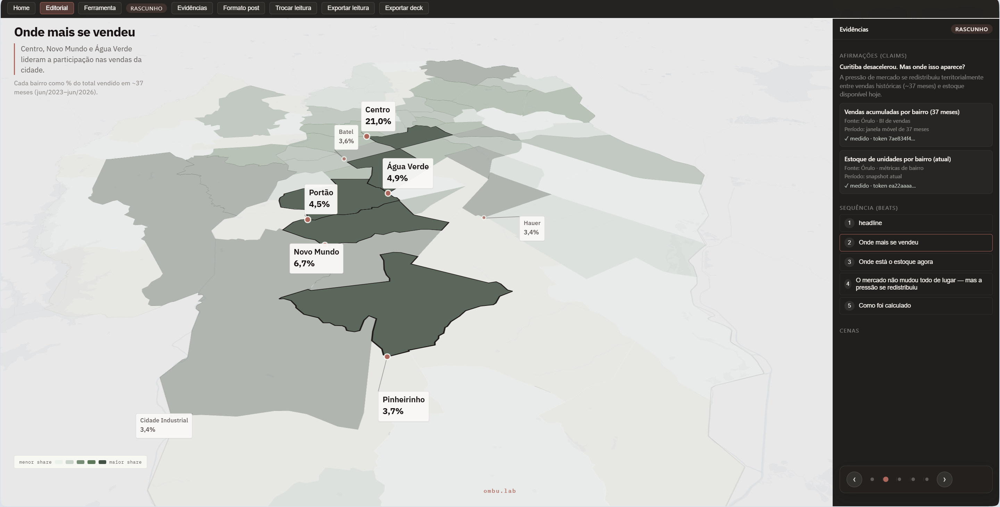
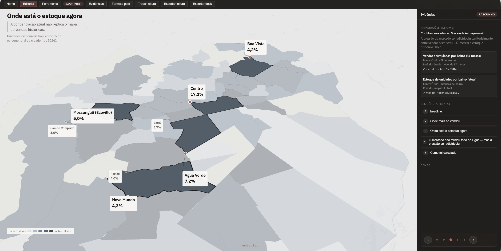
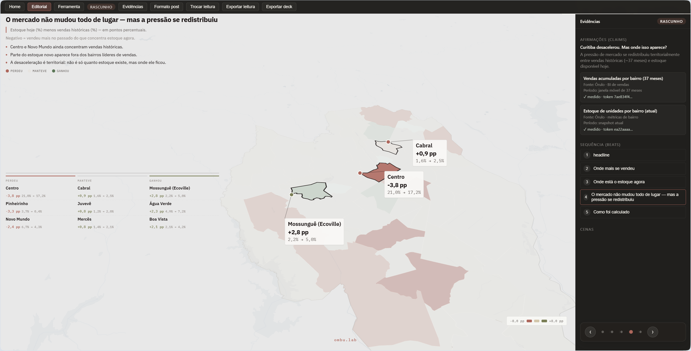
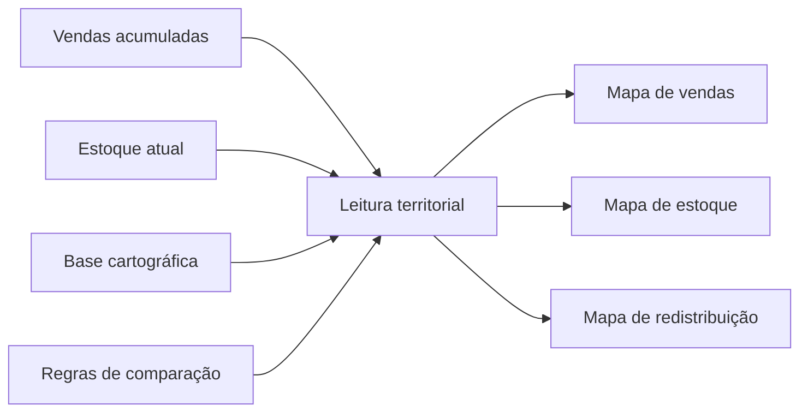

# Atlas urbano de Curitiba · estrutura de mercado e leitura territorial

Caso de leitura territorial em escala de cidade para comparar vendas, estoque e redistribuição de pressão de mercado em uma mesma base analítica.

## O que este caso mostra

- leitura territorial de vendas acumuladas;
- comparação entre estoque atual e histórico de absorção;
- identificação de deslocamentos espaciais de pressão de mercado;
- base auditável para leitura urbana e decisão locacional.

## 1. Onde mais se vendeu

Esta leitura mostra os bairros que lideraram a participação nas vendas acumuladas da cidade. Ela ajuda a localizar os núcleos de absorção histórica e a distinguir centralidades com maior tração de mercado.

## 2. Onde está o estoque agora

O estoque disponível hoje não replica automaticamente o mapa de vendas históricas. Essa leitura mostra onde a oferta atual se concentra e onde o mercado passou a carregar mais unidades disponíveis.

## 3. Onde a pressão se redistribuiu

A comparação direta entre vendas históricas e estoque atual permite ver onde a pressão perdeu força, onde se manteve e onde ganhou relevância. O ponto central não é só quanto estoque existe, mas em que bairros ele ficou.

## Como o atlas é construído

## Bases utilizadas

- base cartográfica oficial de bairros;
- vendas acumuladas em janela móvel;
- snapshot de estoque atual;
- métricas territoriais derivadas para comparação.

## Entregas

- mapa de vendas acumuladas;
- mapa de concentração de estoque atual;
- mapa comparativo de redistribuição de pressão;
- base analítica territorial pronta para leitura editorial;
- evidências espaciais para decisão e comunicação pública.

## Ferramentas

PostGIS · SQL espacial · Python · GeoJSON
