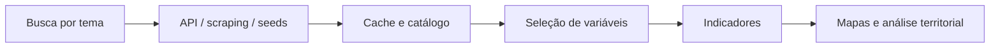

# IBGE/SIDRA · indicadores censitários e leitura territorial

Estrutura para descobrir, coletar e organizar tabelas do IBGE/SIDRA e transformar dados censitários em indicadores utilizáveis para leitura territorial.

## O que este caso mostra

- como tornar o SIDRA operacional para uso real;
- como ligar tabela censitária a análise espacial;
- como montar uma base para renda, domicílio e escolaridade.

## Esquema do fluxo

## Bases utilizadas

- tabelas do IBGE/SIDRA;
- catálogos e seeds confirmados;
- bases territoriais para integração posterior.

## Entregas

- descoberta mais confiável de tabelas;
- base censitária organizada;
- apoio à construção de indicadores;
- conexão entre dado tabular e território.

## Ferramentas

Python · SIDRA API · resolvedor híbrido · cache YAML
